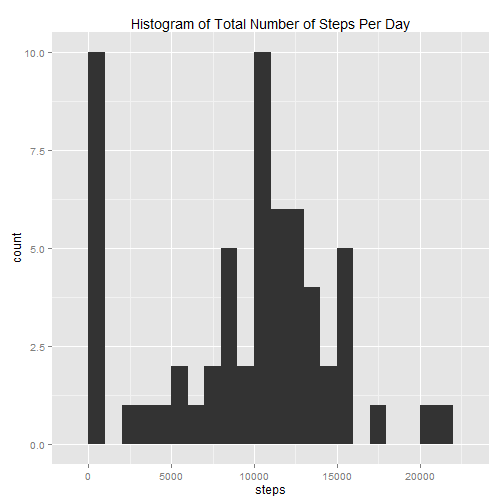

# Reproducible Research: Peer Assessment 1

## Loading and preprocessing the data

I have already unzipped the compressed file "activity.zip" to access the data file "activity.csv". That data file has been placed in my working directory. I will now read in the file.


```r
# read in the CSV file
activity <- read.csv("activity.csv")
```


After examining the data, I found no need to do any additional preprocessing.

## What is mean total number of steps taken per day?

For this section, the instructions said to "ignore the missing values in the dataset". I'm interpreting that instruction to mean that missing values should be treated as zeros.

Below is a histogram of the total number of steps taken each day, along with a calculation of the mean and median total number taken each day.


```r
# create a data frame containing the sum of steps for each date
totalstepsperday <- data.frame(tapply(activity$steps, activity$date, sum, na.rm = TRUE))

# fix the variable name
names(totalstepsperday) <- "steps"

# create a histogram using ggplot
library(ggplot2)
ggplot(totalstepsperday) + aes(x = steps) + geom_histogram(binwidth = 1000) + 
    labs(title = "Histogram of Total Number of Steps Per Day")
```

 

```r

# calculate the mean and median total steps per day
mean(totalstepsperday$steps)
```

```
## [1] 9354
```

```r
median(totalstepsperday$steps)
```

```
## [1] 10395
```


The mean total number of steps per day is 9354, and the median total number of steps per day is 10395.

## What is the average daily activity pattern?

Below is a time series plot of the average number of steps taken during each 5-minute interval (averaged across all days), along with a calculation of which interval contains the maximum number of steps.


```r
# create a data frame containing the mean number of steps for each interval
avgstepsperinterval <- data.frame(tapply(activity$steps, activity$interval, 
    mean, na.rm = TRUE))

# fix the variable name
names(avgstepsperinterval) <- "steps"

# add a new variable for the interval
avgstepsperinterval$interval <- as.integer(row.names(avgstepsperinterval))

# create a plot using ggplot
ggplot(avgstepsperinterval) + aes(x = interval, y = steps) + geom_line() + labs(title = "Time Series Plot of Average Number of Steps Per Interval")
```

 

```r

# determine which interval contains the maximum number of steps
names(which.max(avgstepsperinterval$steps))
```

```
## [1] "835"
```


The interval with the maximum number of steps is 835.

## Imputing missing values

In this section, I'm going to examine and impute missing values.


```r
# calculate the number of missing values
sum(is.na(activity$steps))
```

```
## [1] 2304
```


There are 2304 missing values for "steps" in the dataset.

I'm going to create a new dataset (activity.imp) which is identical to the original dataset (activity), except that the new dataset will have imputed values for any missing values of "steps". The imputed value I'm using is the mean for that 5-minute interval across all days.


```r
# create the new dataset
activity.imp <- activity

# loop through each row in activity
for (i in 1:nrow(activity)) {
    # check if the 'steps' value is missing
    if (is.na(activity$steps[i])) {
        # if so, replace the missing value with the mean for that interval
        activity.imp$steps[i] <- avgstepsperinterval$steps[which(avgstepsperinterval$interval == 
            activity$interval[i])]
    }
}
```


Using the new dataset, I'm going to make a histogram of the total number of steps taken each day, along with a calculation of the mean and median total number taken each day.


```r
# create a data frame containing the sum of steps for each date
totalstepsperday.imp <- data.frame(tapply(activity.imp$steps, activity.imp$date, 
    sum, na.rm = TRUE))

# fix the variable name
names(totalstepsperday.imp) <- "steps"

# create a histogram using ggplot
ggplot(totalstepsperday.imp) + aes(x = steps) + geom_histogram(binwidth = 1000) + 
    labs(title = "Histogram of Total Number of Steps Per Day")
```

 

```r

# calculate the mean and median total steps per day
mean(totalstepsperday.imp$steps)
```

```
## [1] 10766
```

```r
median(totalstepsperday.imp$steps)
```

```
## [1] 10766
```


For the new dataset, the mean and median total number of steps per day are both 10766. This is different from the first part of the assignment. By imputing the missing data, I have increased the estimates of the number of steps because values which were previously NA (and thus treated as zero) are now greater than zero.

## Are there differences in activity patterns between weekdays and weekends?

In this section, I'm going to check for differences in activity patterns between weekdays and weekends. I'm using the dataset with the filled-in missing values (activity.imp).

First, I'll create a factor variable "daytype" to indicate whether each date is a weekday or weekend day.


```r
# use wday function from lubridate to determine if each date is weekday or
# weekend
library(lubridate)
activity.imp$daytype <- as.factor(ifelse(wday(activity.imp$date, label = TRUE) %in% 
    c("Sat", "Sun"), "weekend", "weekday"))
```


Next, I'll split the dataset by daytype. For each of the resulting datasets, I'll calculate the average number of steps for each interval.


```r
# split activity.imp by 'daytype'
s <- split(activity.imp, activity.imp$daytype)

# create data frames containing the mean number of steps for each interval
avgsteps.weekday <- data.frame(tapply(s$weekday$steps, s$weekday$interval, mean))
avgsteps.weekend <- data.frame(tapply(s$weekend$steps, s$weekend$interval, mean))

# fix the variable names
names(avgsteps.weekday) <- "steps"
names(avgsteps.weekend) <- "steps"

# add new variables for the interval
avgsteps.weekday$interval <- as.integer(row.names(avgsteps.weekday))
avgsteps.weekend$interval <- as.integer(row.names(avgsteps.weekend))

# add new variables for the daytype
avgsteps.weekday$daytype <- factor(rep("weekday", nrow(avgsteps.weekday)), levels = c("weekday", 
    "weekend"))
avgsteps.weekend$daytype <- factor(rep("weekend", nrow(avgsteps.weekend)), levels = c("weekday", 
    "weekend"))
```


Finally, I'll combine the datasets back together and create a panel plot to compare the weekday and weekend datasets.


```r
# combine the weekday and weekend datasets
avgsteps.combined <- rbind(avgsteps.weekday, avgsteps.weekend)

# create a plot using ggplot
ggplot(avgsteps.combined) + aes(x = interval, y = steps) + facet_grid(daytype ~ 
    .) + geom_line() + labs(title = "Time Series Plot of Average Number of Steps Per Interval: Comparing Weekday (top) vs. Weekend (bottom)", 
    y = "Number of steps")
```

 


You can see that there are indeed differences in activity patterns between weekdays and weekends.
